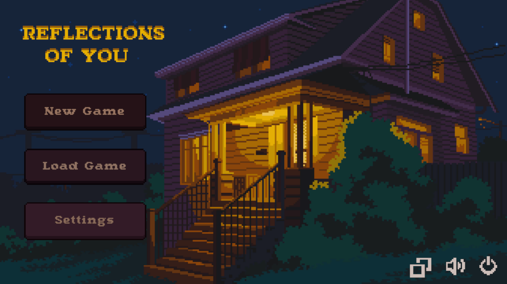
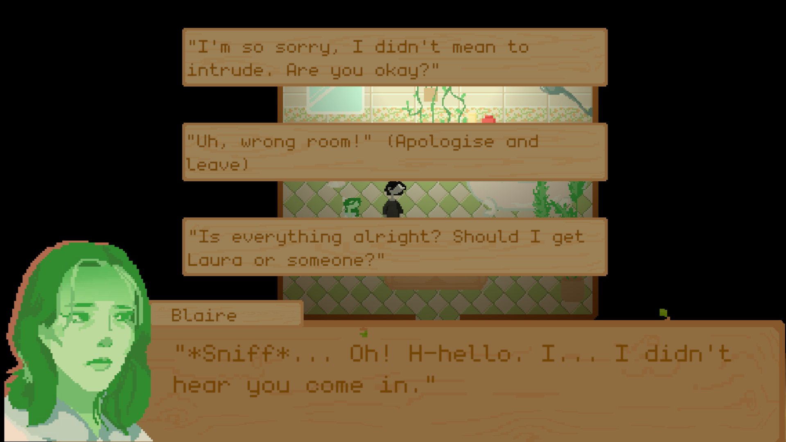
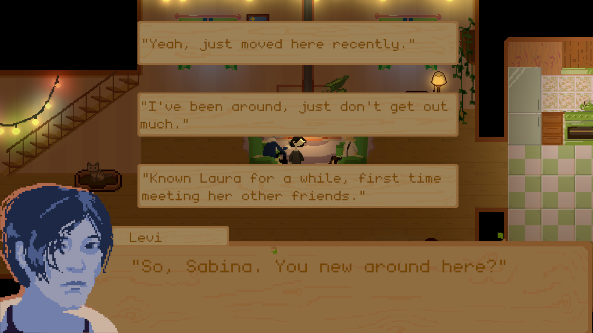
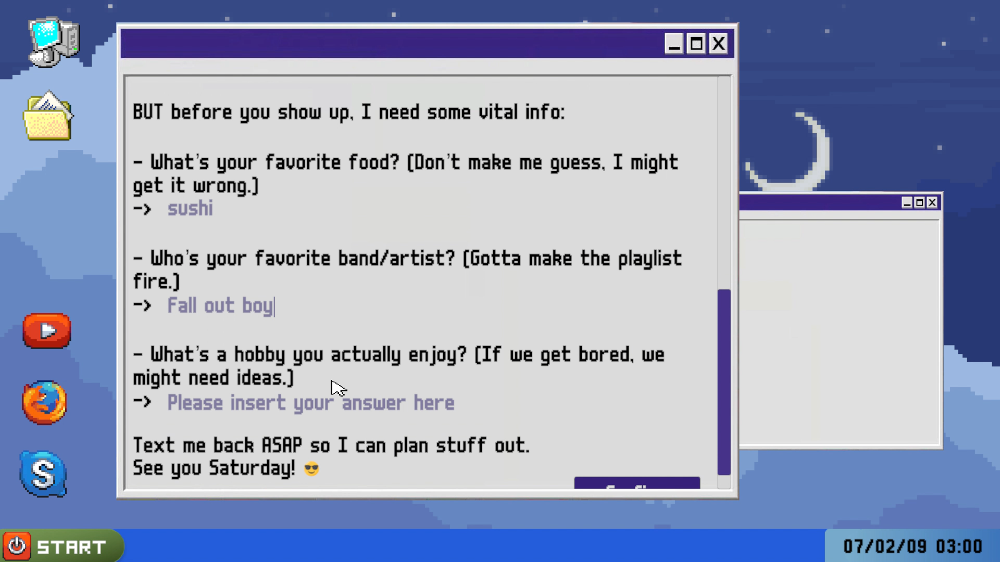
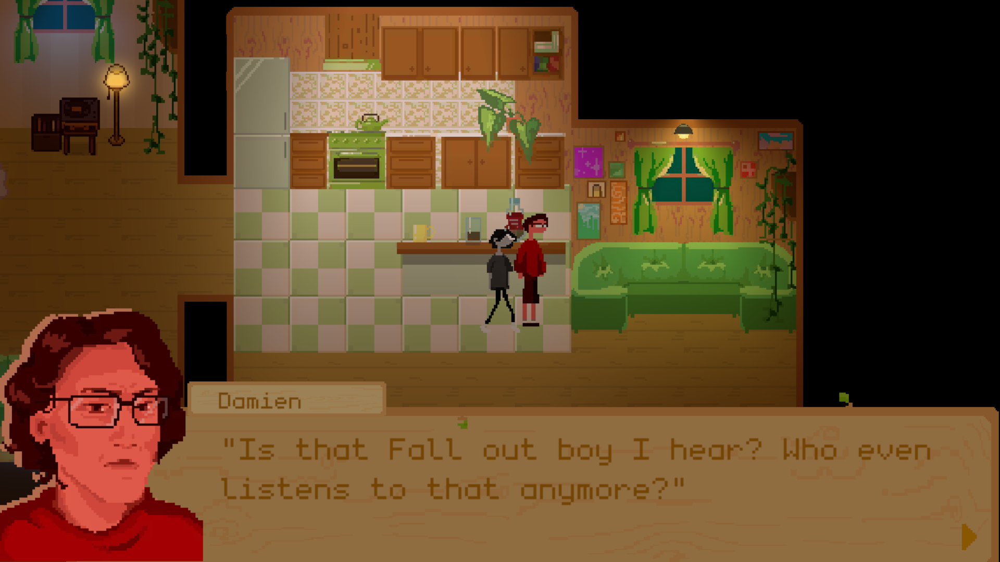
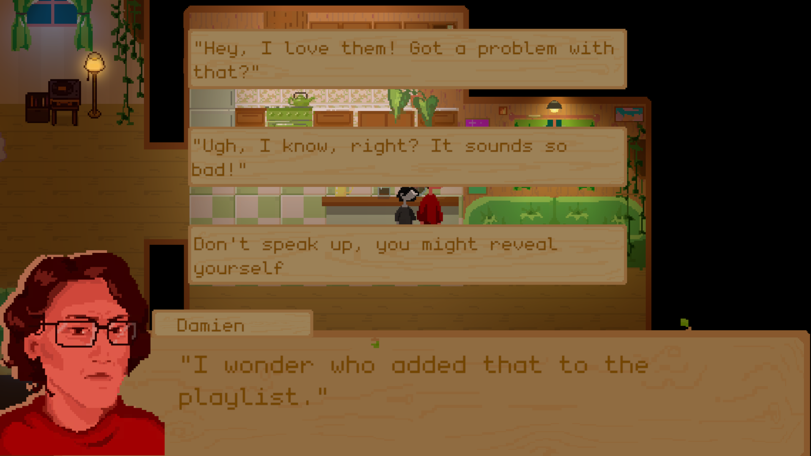

# Reflections of You

> A 2D interactive game developed in Unity as an assessment tool for identifying masking behaviors in high-functioning autism.

## 🌟 About The Project

This project was created as part of a university dissertation and born from a passion to blend technology with psychology. **Reflections of You** is a 2D narrative game that serves as a high-functioning autism assessment tool, with a specific focus on identifying **masking behaviors** in teens and young adults.

As a solo developer, I was responsible for every facet of its creation—from the C# programming and narrative design to the custom visual art and character development. The core of the game lies in its branching dialogue paths and immersive social scenarios, which are designed to gently and accurately highlight the nuanced signs of masking.

To ensure the game's clinical relevance and impact, its development was informed by close collaboration with **psychologists and autism centers**, whose expert feedback was instrumental in shaping the final experience.

### 🎯 Key Features

*   **Interactive Narrative:** Engage in branching dialogue paths where choices matter, revealing different aspects of social interaction.
*   **Purpose-Driven Design:** Every element, from NPC interactions to environmental cues, is crafted to help identify masking behaviors.
*   **Custom Art & Visuals:** A unique visual style with all assets, characters, and environments created specifically for the project.
*   **Expert-Informed Content:** The narrative and scenarios were developed and refined based on feedback from psychology professionals.

---

## 🧑‍💻 Development & Technology

This game was built entirely from the ground up by a single developer.

*   **Engine:** Unity 
*   **Language:** C#
*   **Dialogue System:** Ink 

---

## 🙏 Acknowledgements

This project would not have been possible without the invaluable guidance and expertise from the psychologists and autism centers who generously shared their time and knowledge. Their contributions were vital in creating a tool that is not only functional but also empathetic and respectful.

---

## 📸 Screenshots & Demos

Here is a look at the game in action.

**Main Menu & Opening Scene**

**Branching Dialogue Interaction**
*An example of the branching dialogue system designed to assess social responses.*

**A Key Narrative Moment**

---

### 🔎 Scenario Spotlight: The "Favorite Band" Test

A core mechanic in *Reflections of You* is to test for masking by recalling player inputs from earlier in the game and challenging them in a social context. This scenario demonstrates how an initial, personal preference is later put to the test when faced with potential social judgment.

**Step 1: The Social Challenge**

In this scene, an NPC references the player's favorite band, "Fall Out Boy," which was entered during the game's initial questionnaire. The NPC's comment introduces a subtle social pressure.

*Player inputs their favorite band in the invitation mail.*

*NPC comments on the player's favorite band, creating a social challenge.*

**Step 2: The Masking Choice**

The player is then presented with a critical choice. This moment is designed to directly measure the player's response to the social pressure.
*Player is given a choice to be authentic or to mask their preference.*

The options represent a clear fork:

*   **Authenticity:** To stand by their genuine preference, reinforcing their identity.
*   **Masking:** To downplay or dismiss their interest in an attempt to conform and avoid potential judgment.

This choice directly contributes to the game's assessment, providing a tangible data point on the player's tendency to mask their true self.

---

### 🎬 Gameplay Demos (GIFs)

*A showcase of core gameplay mechanics and character interactions.*

**Character Exploration**
*The game introduction.*

**Story Flow**
*The course of the story*

**Interactive Dialogue System**
*Watch the dialogue system in action as the player makes a critical choice.*

